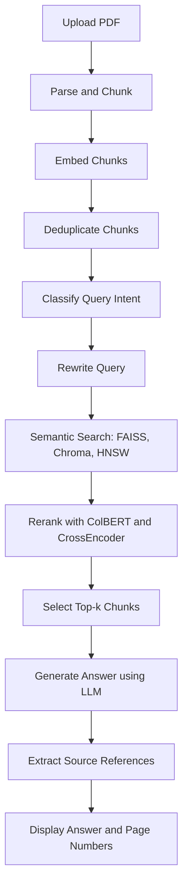

# 📄 Docu-Mentor — Agentic RAG PDF Question Answering System

Docu-Mentor is a powerful, modular, and explainable **document QA system** that uses:

- 🧠 Multi-agent orchestration  
- 🔍 Retrieval-Augmented Generation (RAG)  
- 🤖 LLMs for answer synthesis  
- 🗂 Page-level referencing with chunk highlighting  
- ✅ Semantic deduplication, hybrid reranking, and memory-free stateless context

---

## 🚀 Features

- Upload PDFs, DOCX, TXT, CSV, or MD
- Chunking, Embedding & Vector Store caching
- Query rewriting via intent classification
- Hybrid semantic retrieval: FAISS, ChromaDB, HNSW & ColBERT
- CrossEncoder + LLM-based reranking
- Markdown-based Streamlit chat UI with PDF preview
- 🔗 Page number references beneath each answer

---

## 🧠 What Each Agent Does

| Agent | Description |
|-------|-------------|
| **IngestionAgent** | Loads and parses documents, generates chunks, computes embeddings, saves to vector store |
| **EmbeddingAgent** | Deduplicates chunks, encodes using transformer models, builds HNSW index and Chroma collection |
| **RetrievalAgent** | Retrieves top-k chunks via HNSW, FAISS, Chroma + hybrid ColBERT scoring |
| **QueryRewriteAgent** | Classifies query intent (statistical, causal, factual...) and rewrites query using few-shot prompting |
| **RerankerAgent** | Reranks retrieved chunks using CrossEncoder and optionally LLM-based ReAct scoring |
| **LLMResponseAgent** | Builds final prompt and streams answer using OpenRouter models (GPT-4, Claude, Grok) with fallback |
| **PromptFormatterAgent** | Converts chunks into formatted prompts (QA, comparison, summarization, extraction) |
| **ColBERTRetrievalAgent** | Performs token-level semantic scoring using ColBERT-style late interaction retrieval |

---

## 🛠️ Project Setup

### 1. 📦 Clone the Repo

```bash
git clone https://github.com/yourname/documind-lite.git
cd documind-lite
```

### 2. 🐍 Create Virtual Environment

```bash
python -m venv .venv
# Activate:
# Windows
.venv\Scripts\activate
# macOS/Linux
source .venv/bin/activate
```

### 3. 📚 Install Dependencies

```bash
pip install -r requirements.txt
```

---

## 🔑 Environment Variables (`.env`)

### Create a `.env` file in the project root:

```
OPENROUTER_API_KEY=your_openrouter_api_key
OPENROUTER_BASE_URL=https://openrouter.ai/api/v1
DEFAULT_MODEL=openrouter/openai/gpt-4

MODEL_1=openrouter/openai/gpt-4
MODEL_2=openrouter/anthropic/claude-3-opus
MODEL_3=openrouter/grok-1

TEMPERATURE=0.4
API_TIMEOUT=30
MAX_RETRIES=3
```

You can modify `DEFAULT_MODEL` or fallback model values as per your OpenRouter availability.

---

## 📂 Poppler Setup (for PDF rendering)

PDF previews use `pdf2image`, which requires Poppler binaries.

### 🔧 Windows:

1. Download Poppler from:  
   https://github.com/oschwartz10612/poppler-windows/releases/
2. Extract to:
   ```
   docu-mentor/poppler/Library/bin
   ```
3. Final structure:
   ```
   docu-mentor/
   ├── viewer_component.py
   └── poppler/
       └── Library/
           └── bin/
               └── pdftoppm.exe, etc.
   ```

### 🐧 Linux / Mac:

```bash
sudo apt install poppler-utils
```

---

## 💡 How to Run

```bash
streamlit run app.py
```

---

## 📁 Directory Structure

```
docu-mentor/
├── app.py
├── chat.py
├── viewer_component.py
├── upload_modal.py
├── session_manager.py
├── streaming_response.py
├── config.py
├── requirements.txt
├── README.md
├── .env
│
├── agents/
│   ├── ingestion_agent.py
│   ├── embedding_agent.py
│   ├── retrieval_agent.py
│   ├── query_rewrite_agent.py
│   ├── reranker_agent.py
│   ├── llm_response_agent.py
│   ├── prompt_formatter_agent.py
│   └── colbert_retrieval_agent.py
│
├── core/
│   ├── agent_manager.py
│   ├── config_manager.py
│   ├── document_loader.py
│   ├── embeddings.py
│   ├── hnswlib_search.py
│   ├── mcp.py
│   ├── utils.py
│   └── model_manager.py
│
├── utils/
│   └── page_utils.py
│
├── data/
│   └── [uploaded documents + vector store data]
├── models/
│   └── [HF-downloaded SentenceTransformer models]
└── vector_store/
    ├── faiss_store.pkl
    ├── chroma/
    ├── memory/
    └── doc_cache/
```

---

## 🧠 Architecture Overview



---

## 🔄 Full Process Breakdown

1. **📤 Upload PDF**  
   `app.py` handles file upload and stores it in `/data`

2. **📄 Parse & Chunk**  
   `document_loader.py` extracts text based on format and chunks it

3. **🔡 Embedding**  
   `embedding_agent.py` generates embeddings via BGE or MiniLM

4. **🧼 Deduplication**  
   Chunks with >92% similarity are dropped using cosine distance

5. **✏️ Query Rewrite**  
   `query_rewrite_agent.py` classifies query type and rewrites it for optimal retrieval

6. **🔎 Retrieval**  
   `retrieval_agent.py`:
   - Tries HNSW first
   - Falls back to FAISS + Chroma
   - Applies ColBERT-based scoring

7. **⚖️ Reranking**  
   `reranker_agent.py`:
   - Uses `ms-marco-MiniLM` CrossEncoder
   - Optionally reranks via LLM using ReAct-style reasoning

8. **🤖 LLM Answering**  
   `llm_response_agent.py` builds a structured prompt using:
   - Retrieved chunks
   - Model fallback and retry logic

9. **📄 Reference Extraction**  
   `"source": "filename.pdf p. 3"` from chunks is parsed

10. **💬 Final Output**  
    - Assistant response shown
    - Page numbers displayed as:
      ```
      🔗 References: Page 3, Page 7
      ```

---

## ✅ Credits

Built with:

- [Streamlit](https://streamlit.io/)
- [LangChain](https://www.langchain.com/)
- [Sentence-Transformers](https://www.sbert.net/)
- [ChromaDB](https://www.trychroma.com/)
- [FAISS](https://github.com/facebookresearch/faiss)
- [HNSWlib](https://github.com/nmslib/hnswlib)
- [POPPLER](https://github.com/oschwartz10612/poppler-windows)

---

